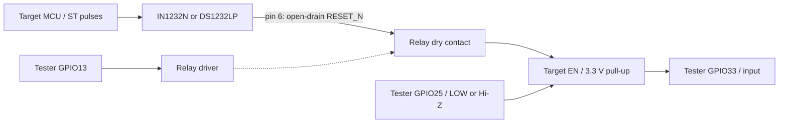

# IC WDT Tester — ESP32

RU: Отдельная плата ESP32 управляет реле внешнего watchdog, выполняет внешний сброс и наблюдает линию EN. Вывод Serial: текст для человека слева, JSON для ИИ справа.  
中文：独立 ESP32 测试板控制外部看门狗继电器、执行外部复位并监测 EN。串口输出左侧为可读文本，右侧为供 AI 解析的 JSON。  
EN: A separate ESP32 board controls the external watchdog relay, applies external reset and observes EN. Serial output places human-readable text on the left and JSON for AI on the right.

RU: Описание идёт построчно: русский → китайский → английский. Активный код — [src/main.cpp](src/main.cpp), среда PlatformIO — `ic_wdt_tester`.  
中文：说明按俄语 → 中文 → 英语逐行排列。当前代码为 [src/main.cpp](src/main.cpp)，PlatformIO 环境为 `ic_wdt_tester`。  
EN: Descriptions alternate Russian → Chinese → English. Active code: [src/main.cpp](src/main.cpp); PlatformIO environment: `ic_wdt_tester`.

## Микросхема и схема / 芯片与电路 / IC and circuit

RU: [IN1232N / DS1232LP: схема и настройка](docs/IC_WDT_HARDWARE.md) — как выбрать порог понижения питания TOL и время watchdog TD, согласовать 5 В с ESP32 3,3 В и проверить сброс. [Оригинальные PDF](docs/datasheets/README.md) сохранены с источниками и SHA-256.  
中文：[IN1232N / DS1232LP 电路及设置](docs/IC_WDT_HARDWARE.md)说明如何选择 TOL 欠压阈值和 TD 看门狗超时、连接 5 V 芯片与 3.3 V ESP32，以及验证复位。[原始 PDF](docs/datasheets/README.md)已保存并记录来源和 SHA-256。  
EN: [IN1232N / DS1232LP circuit and settings](docs/IC_WDT_HARDWARE.md) explain TOL undervoltage thresholds, TD watchdog timeouts, the 5 V to 3.3 V interface and reset verification. [Original PDFs](docs/datasheets/README.md) are saved with sources and SHA-256.



RU: Функциональная схема; полная распиновка и общая земля — в руководстве выше. Импульсы ST выдаёт проверяемая плата. Тестер не генерирует их и не определяет причину сброса только по EN.  
中文：这是功能图；完整引脚接线和共地要求见上述指南。ST 脉冲由被测板产生。测试器不生成 ST，也不能仅根据 EN 判断复位原因。  
EN: This is a functional diagram; see the guide above for pin-level wiring and common ground. The target board generates ST pulses. The tester does not generate them or identify the reset cause from EN alone.

## Пины / 引脚 / Pins

| GPIO | RU<br>中文<br>EN |
| --- | --- |
| 13 | Реле: HIGH = ON, LOW = OFF; после запуска ON.<br>继电器：HIGH = ON，LOW = OFF；启动后为 ON。<br>Relay: HIGH = ON, LOW = OFF; ON after startup. |
| 25 | Внешний сброс: LOW → INPUT (Hi-Z), активного HIGH нет.<br>外部复位：LOW → INPUT（高阻），不主动输出 HIGH。<br>External reset: LOW → INPUT (Hi-Z), never actively HIGH. |
| 33 | Наблюдение EN: INPUT_PULLUP, фильтр 40 мс.<br>EN 监测：INPUT_PULLUP，40 ms 滤波。<br>EN observation: INPUT_PULLUP, 40 ms filter. |
| 2 | Wi-Fi LED: ожидание 1 Гц, подключение 4 Гц, соединён — горит.<br>Wi-Fi LED：等待时 1 Hz，连接时 4 Hz，连接成功后常亮。<br>Wi-Fi LED: waiting 1 Hz, connecting 4 Hz, connected steady ON. |

RU: RESET перенесён с GPIO12 на GPIO25. Переставлять только конец провода на тестере при отключённом питании; второй конец остаётся на EN целевой платы. GPIO12 больше не используется для этой линии. Входы ESP32 не допускают 5 В. [Подключение](docs/WIRING.md).  
中文：RESET 已从 GPIO12 改为 GPIO25。断电后只移动测试器一端的接线，另一端仍接目标板 EN。GPIO12 不再用于该信号。ESP32 输入不能接 5 V。[接线说明](docs/WIRING.md)。  
EN: RESET moved from GPIO12 to GPIO25. With power off, move only the tester end of the wire; the target end stays on EN. GPIO12 is no longer used for this line. ESP32 inputs must not receive 5 V. [Wiring](docs/WIRING.md).

## Команды и JSON / 命令与 JSON / Commands and JSON

RU: Serial: **115200, 8N1, UTF-8**; одна команда на строку, CR/LF. Начать с `HELP` и `STS`. `OFF` сохраняется до `ON`, `RESET` или reboot. `RESET`: OFF → GPIO25 LOW на 1000 мс → отпустить → ON. `RST` перезапускает сам тестер. [Полная семантика и исключения](docs/COMMANDS.md).  
中文：串口：**115200、8N1、UTF-8**；每行一条命令，CR/LF 结尾。先执行 `HELP` 和 `STS`。`OFF` 保持到 `ON`、`RESET` 或重启。`RESET`：OFF → GPIO25 拉低 1000 ms → 释放 → ON。`RST` 重启测试器本身。[完整语义及例外](docs/COMMANDS.md)。  
EN: Serial: **115200, 8N1, UTF-8**; one command per line, CR/LF. Start with `HELP` and `STS`. `OFF` persists until `ON`, `RESET` or reboot. `RESET`: OFF → GPIO25 LOW for 1000 ms → release → ON. `RST` reboots the tester itself. [Full semantics and exceptions](docs/COMMANDS.md).

```text
WDT/EN GPIO33 HIGH -> LOW | JSON {"unix_time":1789746536,"schema":1,"source":"ic_wdt_tester","subsystem":"WDT","signal":"EN","wdt_triggered":null,"type":"gpio_change","replay":false,"event_id":1,"uptime_ms":50,"time_valid":true,"gpio":33,"old":"HIGH","new":"LOW","relay_on":true,"reset_active":false}
```

RU: Это пример формата, не текущее измерение. ИИ читает JSON после ` | JSON `; старые отдельные строки `JSON {...}` тоже поддерживаются. Переход EN не доказывает срабатывание watchdog. [Контракт и offline-парсер](docs/TELEMETRY.md).  
中文：这是格式示例，并非当前测量值。AI 读取 ` | JSON ` 后的数据，也兼容旧式独立 `JSON {...}` 行。EN 电平变化不能证明看门狗触发。[协议与离线解析器](docs/TELEMETRY.md)。  
EN: This is a format example, not a live measurement. AI reads data after ` | JSON `; older standalone `JSON {...}` lines also work. An EN transition does not prove a watchdog event. [Contract and offline parser](docs/TELEMETRY.md).

## Начало работы / 入门 / Getting started

RU: [Первый запуск](docs/GETTING_STARTED.md): Wi-Fi, SDK, сборка и проверка платы. Пароли хранятся только в игнорируемом `src/secrets.h`; образец — [secrets.example.h](src/secrets.example.h). SDK и BIN в публичный архив не входят; проверенный SDK содержит локальный пакет esptool.  
中文：[首次运行](docs/GETTING_STARTED.md)介绍 Wi-Fi、SDK、编译和板卡检查。密码仅保存在被忽略的 `src/secrets.h` 中，模板为 [secrets.example.h](src/secrets.example.h)。公开归档不包含 SDK 或 BIN；已验证的 SDK 使用本地 esptool 包。  
EN: [First setup](docs/GETTING_STARTED.md) covers Wi-Fi, SDK, build and board checks. Passwords belong only in ignored `src/secrets.h`; use [secrets.example.h](src/secrets.example.h) as a template. Public exports exclude SDK and BIN; the validated SDK uses a local esptool package.

```powershell
python -B tools/project.py check
python -B tools/project.py test
python -B tools/sdk_preflight.py
pio run -e ic_wdt_tester
```

RU: Команды сборки требуют подготовленного SDK. Успешные проверки исходников и сборка не подтверждают установленную прошивку или физическую работу схемы. [Приёмка](docs/ACCEPTANCE.md).  
中文：编译命令需要先准备 SDK。源码检查或编译成功并不证明固件已安装，也不证明电路实际正常工作。[验证记录](docs/ACCEPTANCE.md)。  
EN: Build commands require a prepared SDK. Passing source checks and builds does not confirm installed firmware or physical circuit operation. [Acceptance](docs/ACCEPTANCE.md).

## Документы / 文档 / Documentation

RU: Ссылки ниже ведут на подробные инструкции; они пока преимущественно на русском. Трёхъязычные материалы — эта страница, руководство микросхем и реестр PDF.  
中文：以下链接指向详细指南，目前主要为俄语。三语资料包括本页、芯片指南和 PDF 目录。  
EN: The detailed guides below are currently mainly in Russian. This page, the IC guide and the PDF register are trilingual.

- [Принцип работы / 工作原理 / Firmware operation](docs/HOW_IT_WORKS.md)
- [Проверки и ограничения / 验证与限制 / Validation and limits](docs/VALIDATION_20260919.md)
- [Неисправности / 故障排查 / Troubleshooting](docs/TROUBLESHOOTING.md)
- [GitHub / 发布 / Publication](docs/GITHUB.md), [CONTRIBUTING](CONTRIBUTING.md)
- [AI_QUICKSTART](docs/AI_QUICKSTART.md), [OPERATOR](docs/OPERATOR.md)
- [USB/COM](docs/USB_COM_RECOVERY.md), [план / 计划 / plan](USB_RESTART_PLAN.md)
- [Файлы / 文件 / Files](docs/PROJECT_LAYOUT.md), [перенос / 迁移 / portability](docs/PORTABILITY.md)
- [Передача / 交接 / Handoff](docs/HANDOFF.md), [индекс / 索引 / index](docs/INSTRUCTIONS_INDEX.md)

RU: USB-журнал — `usb-restart.log` в корне. Скрипт [restart_usb_port.ps1](tools/restart_usb_port.ps1) без `-Apply` показывает preview; реальное действие требует точного USB InstanceId. Архив LATCH-02 сохранён для IC_WDT_Probe, активная сборка его не использует. [Совместимость](docs/LEGACY_LATCH02.md).  
中文：USB 日志为根目录的 `usb-restart.log`。[restart_usb_port.ps1](tools/restart_usb_port.ps1) 不加 `-Apply` 时仅预览，实际操作需要准确的 USB InstanceId。LATCH-02 保留供 IC_WDT_Probe 使用，不属于当前编译目标。[兼容性](docs/LEGACY_LATCH02.md)。  
EN: USB history is in root-level `usb-restart.log`. [restart_usb_port.ps1](tools/restart_usb_port.ps1) previews without `-Apply`; an actual operation requires an exact USB InstanceId. LATCH-02 is retained for IC_WDT_Probe and is not part of the active build. [Compatibility](docs/LEGACY_LATCH02.md).

## Лицензия / 许可证 / License

RU: Владелец пока не выбрал лицензию проекта; LICENSE отсутствует. Зависимости и оригинальные PDF имеют собственных правообладателей и условия использования.  
中文：项目所有者尚未选择许可证，当前没有 LICENSE 文件。依赖项及原始 PDF 各有其权利人和使用条款。  
EN: The owner has not selected a project license; there is no LICENSE file. Dependencies and original PDFs retain their respective owners and terms.
