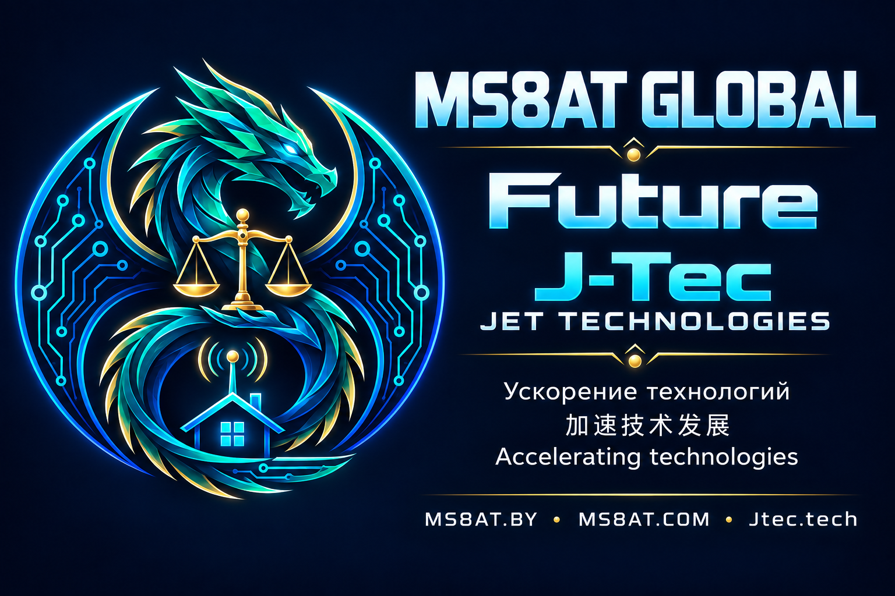

# MS8AT GLOBAL — Future — J-Tec

## Русский

**J-Tec расшифровывается как Jet Technologies.** Смысл названия — **ускорение технологий**: идея, разработка, проверка и следующий шаг развития. Компания — **MS8AT GLOBAL**, проект — **Future**, технологическое обозначение — **J-Tec**.

Иллюстрация создана с помощью AI по выбранным владельцем изображениям дракона и логотипу Future. В тёмном технологичном оформлении объединены крылья со схемами, антенна с радиоволнами, домик и золотые весы. Сверху расположено MS8AT GLOBAL, ниже — Future, J-Tec, Jet Technologies и подписи на трёх языках. Внизу указаны адреса, предоставленные владельцем: MS8AT.BY · MS8AT.COM · Jtec.tech. Это иллюстрация бренда; фотографии реальных плат находятся в [галерее](GALLERY.md).

Написание проекта — Future; J-Tec — Jet Technologies. Название инициативы не меняет юридическое наименование ООО «МС8АТ Глобал». [Компания](https://ms8at.by/) · [Описание Future](FUTURE.md) · [Условия использования материалов](LICENSING.md).

## 中文

**J-Tec 是 Jet Technologies 的缩写。** 名称表达的理念是**加速技术发展**：从构想到开发、验证，再进入下一步。公司名称为 **MS8AT GLOBAL**，项目名称为 **Future**，技术名称为 **J-Tec**。

本插图由 AI 辅助创作，参考了所有者选定的龙形图案和 Future 标志。深色科技风格融合了电路翅膀、带无线电波的天线、小屋和金色天平。顶部为 MS8AT GLOBAL，下方依次为 Future、J-Tec、Jet Technologies 和三语说明。底部列出所有者提供的网址：MS8AT.BY · MS8AT.COM · Jtec.tech。这是品牌插图；实际板卡照片见[图库](GALLERY.md)。

项目拼写为 Future；J-Tec 表示 Jet Technologies。倡议名称不改变 ООО «МС8АТ Глобал» 的法定名称。[公司](https://ms8at.by/) · [Future 介绍](FUTURE.md) · [材料使用条款](LICENSING.md)。

## English

**J-Tec stands for Jet Technologies.** The name expresses **accelerating technologies**: from an idea to development, verification and the next step. The company is **MS8AT GLOBAL**, the project is **Future**, and the technology name is **J-Tec**.

The illustration was created with AI assistance using the dragon images and Future logo selected by the owner. Its dark technology theme combines circuit wings, an antenna with radio waves, a small house and gold balance scales. MS8AT GLOBAL appears at the top, followed by Future, J-Tec, Jet Technologies and captions in three languages. The footer displays the addresses supplied by the owner: MS8AT.BY · MS8AT.COM · Jtec.tech. This is a brand illustration; actual board photographs are in the [gallery](GALLERY.md).

The project spelling is Future; J-Tec means Jet Technologies. The initiative name does not change the legal name ООО «МС8АТ Глобал» (MS8AT GLOBAL). [Company](https://ms8at.by/) · [About Future](FUTURE.md) · [Material use terms](LICENSING.md).
