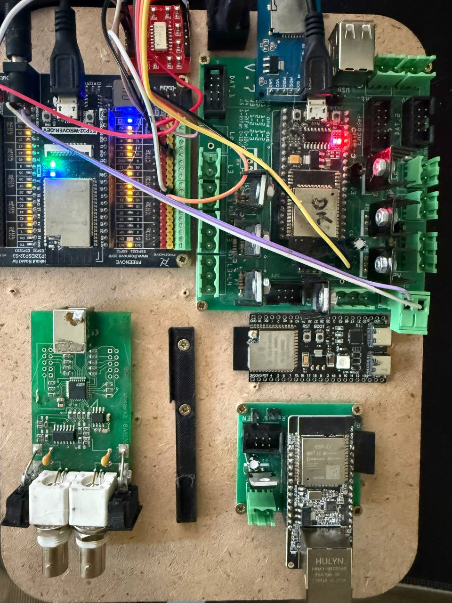
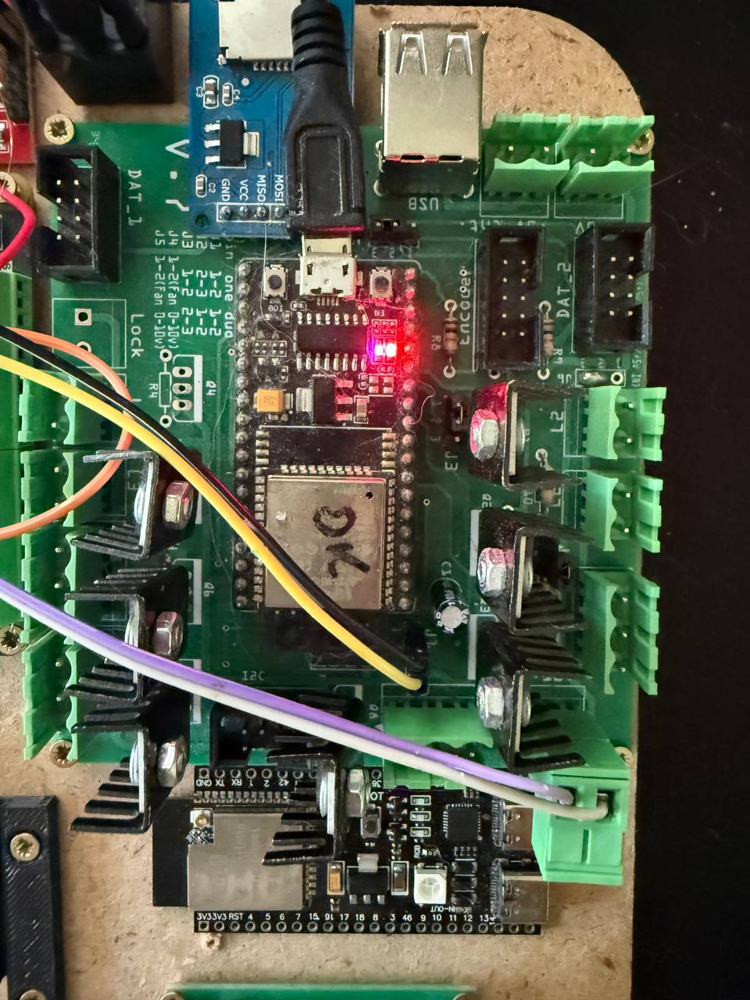
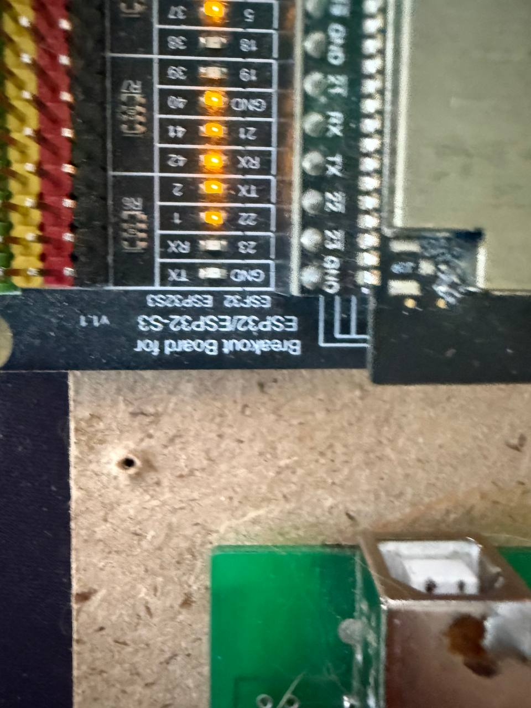
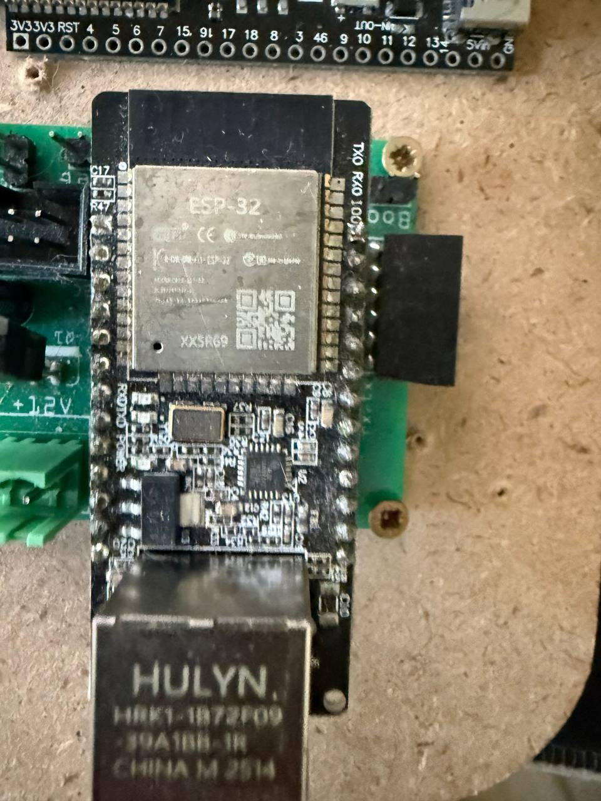
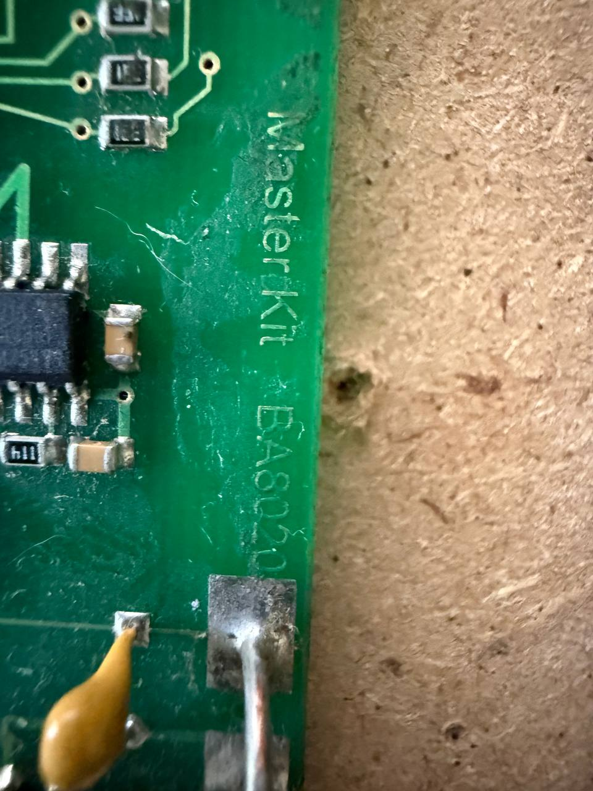
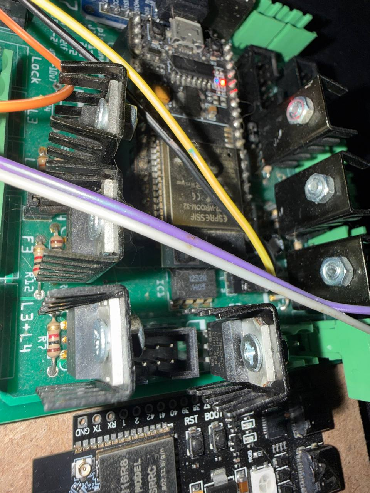
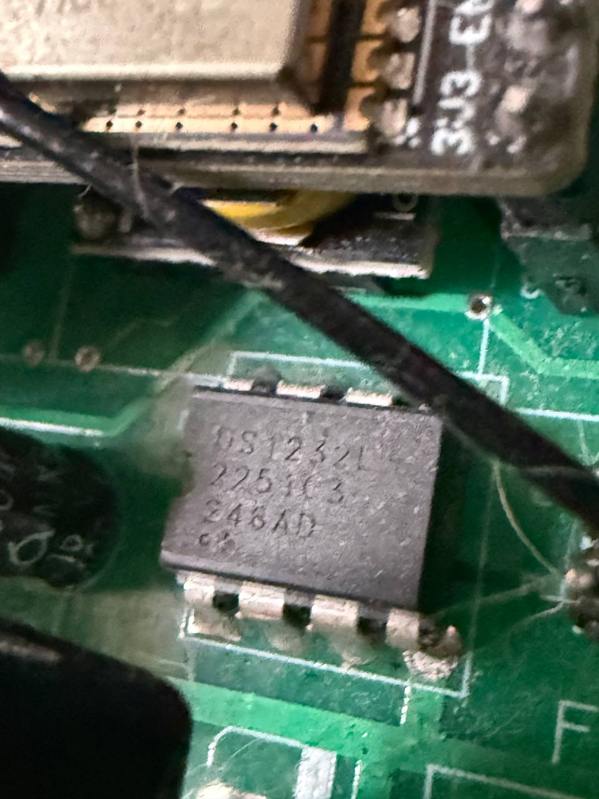

# Стенд Future / Future 测试台 / Future bench

RU: Фотографии предоставлены MS8AT GLOBAL для открытой публикации. Это экспериментальный стенд проекта Future; фотографии показывают состав и монтаж, но не подтверждают завершённую интеграцию или результаты испытаний. Оригинальные изображения опубликованы без ретуши.

中文：照片由 MS8AT GLOBAL 提供并授权公开发布。这是 Future 项目的实验测试台；照片展示设备和安装情况，并不证明已完成集成或通过测试。原始图像未经修饰。

EN: Photos were supplied by MS8AT GLOBAL for open publication. This is an experimental Future bench; the images show equipment and assembly, not proof of completed integration or successful tests. Original images are published without retouching.

## 1. Общий вид / 整体外观 / Overview

RU: На основании размещены плата FREENOVE слева, основной контроллер на зелёной плате справа, небольшой модуль ESP32-S3 между ними и нижними платами, USB-осциллограф MasterKit внизу слева и ESP32 с Ethernet внизу справа. Сверху виден модуль microSD по SPI. Назначение каждого соединения определяется схемой, а не цветом провода.

中文：底板左上为 FREENOVE 板，右上为绿色主控制板；中间有小型 ESP32-S3 板，左下为 MasterKit USB 示波器，右下为带以太网接口的 ESP32 板。上方可见 SPI microSD 模块。接线用途应以电路图为准，不能按导线颜色判断。

EN: The base holds a FREENOVE board on the left, the main controller on a green carrier on the right, a small ESP32-S3 board in the middle, a MasterKit USB oscilloscope at bottom left and an ESP32 Ethernet board at bottom right. An SPI microSD module is visible at the top. Connection functions must be determined from the circuit, not wire colours.

## 2. Основной контроллер / 主控制器 / Main controller

RU: На большой зелёной плате установлен модуль семейства Espressif ESP-WROOM-32. Видны клеммники, разъёмы, радиаторы и ручной монтаж. Точную модель и ревизию зелёной платы по фото установить нельзя. Ниже находится отдельная плата с модулем ESP32-S3-WROOM-1; вариант памяти не читается.

中文：大型绿色板上安装了 Espressif ESP-WROOM-32 系列模块，可见接线端子、连接器、散热器和手工接线。无法仅凭照片确定绿色板的准确型号和版本。下方独立板采用 ESP32-S3-WROOM-1 模块，存储容量型号无法辨认。

EN: The large green carrier holds an Espressif ESP-WROOM-32 family module, terminals, connectors, heatsinks and hand wiring. Its exact carrier model and revision cannot be established from the photo. Below it is a separate ESP32-S3-WROOM-1 module board; the memory variant is unreadable.

## 3. Переходник FREENOVE / FREENOVE 转接板 / FREENOVE breakout

RU: На переходнике читается «Breakout Board for ESP32/ESP32-S3 V1.1». На установленной плате в общем кадре видна надпись «ESP32-WROVER-DEV». Совместимость переходника с ESP32-S3 не означает, что установленный модуль относится к S3. [Материалы FREENOVE](https://github.com/Freenove/Freenove_ESP32_WROVER_Board).

中文：转接板标有“Breakout Board for ESP32/ESP32-S3 V1.1”；整体照片中的开发板标有“ESP32-WROVER-DEV”。转接板兼容 ESP32-S3 并不表示当前模块就是 S3。[FREENOVE 资料](https://github.com/Freenove/Freenove_ESP32_WROVER_Board)。

EN: The carrier reads “Breakout Board for ESP32/ESP32-S3 V1.1”; the installed development board reads “ESP32-WROVER-DEV” in the overview. Breakout compatibility with ESP32-S3 does not identify the installed module as an S3. [FREENOVE resources](https://github.com/Freenove/Freenove_ESP32_WROVER_Board).

## 4. Ethernet / 以太网 / Ethernet

RU: Видны маркировка «ESP-32», разъём RJ45 и контактные площадки TX0/RX0/IO0. «HULYN» относится к разъёму. Точный артикул Ethernet-платы не подтверждён; обозначение WT32-ETH01 ей не присваивается по внешнему сходству.

中文：可见“ESP-32”标识、RJ45 接口以及 TX0/RX0/IO0 焊盘。“HULYN”是连接器上的标识。以太网板的准确型号尚未确认，不根据外观相似性将其认定为 WT32-ETH01。

EN: Visible features include the “ESP-32” marking, RJ45 connector and TX0/RX0/IO0 pads. “HULYN” marks the connector. The Ethernet board's exact part number is unconfirmed; visual similarity alone does not establish it as a WT32-ETH01.

## 5. MasterKit / MasterKit / MasterKit

RU: На плате читается «MasterKit BA8020». Компоновка с USB и двумя BNC соответствует семейству USB-осциллографов BM8020 из [каталога производителя](https://masterkit.ru/shop/1352554). Это предварительное сопоставление маркировки и конструкции. Драйвер, калибровка, точность и подключение к Future здесь не проверены.

中文：板上可辨认“MasterKit BA8020”。USB 与两个 BNC 接口的布局符合[制造商目录](https://masterkit.ru/shop/1352554)中的 BM8020 USB 示波器系列。这是基于标识和结构的初步对应；驱动、校准、精度及与 Future 的集成尚未在此验证。

EN: The board reads “MasterKit BA8020”. Its USB and two-BNC layout corresponds to the BM8020 USB oscilloscope family in the [manufacturer's catalogue](https://masterkit.ru/shop/1352554). This is a preliminary match of markings and construction. Drivers, calibration, accuracy and Future integration have not been verified here.

## 6. Детали монтажа / 安装细节 / Assembly detail

RU: Крупный план модуля ESP-WROOM-32, радиаторов и расположенного рядом DIP-корпуса. Фото позволяет рассмотреть монтаж, но не заменяет электрическую схему или измерения.

中文：ESP-WROOM-32 模块、散热器及附近 DIP 封装的特写。照片可用于查看安装细节，但不能替代电路图或测量。

EN: Close-up of the ESP-WROOM-32 module, heatsinks and nearby DIP package. The photo documents assembly detail and does not replace a circuit diagram or measurements.

## 7. Внешний watchdog / 外部看门狗 / External watchdog

RU: На дополнительном крупном плане читается «DS1232L». Полное исполнение и остальные строки маркировки не устанавливаются по этому кадру. Справочная схема семейства — [IN1232N / DS1232LP](IC_WDT_HARDWARE.md); её наличие не подтверждает фактическую распайку или настройки данного экземпляра.

中文：附加特写中可辨认“DS1232L”。仅凭此图不能确定完整型号及其余标识。系列参考电路见 [IN1232N / DS1232LP](IC_WDT_HARDWARE.md)；参考资料并不证明此器件的实际接线或设置。

EN: The additional close-up shows “DS1232L”. The complete variant and remaining markings cannot be established from this frame. See the [IN1232N / DS1232LP](IC_WDT_HARDWARE.md) family reference circuit; it does not verify this specimen's actual wiring or settings.

---

RU: Оригинальные фотографии этой галереи входят в документацию MS8AT GLOBAL и предоставлены по [MIT](../LICENSE); сохраняйте уведомление об авторских правах и текст лицензии. Изображённые сторонние изделия и товарные знаки принадлежат своим правообладателям. [Условия использования](LICENSING.md) · [Future](FUTURE.md).

中文：本图库的原创照片属于 MS8AT GLOBAL 文档，按 [MIT](../LICENSE) 提供；请保留版权声明及许可文本。照片中的第三方产品和商标属于各自权利人。[使用条件](LICENSING.md) · [Future](FUTURE.md)。

EN: Original gallery photos form part of MS8AT GLOBAL documentation and are provided under [MIT](../LICENSE); retain the copyright notice and license text. Depicted third-party products and trademarks belong to their respective rights holders. [Terms of use](LICENSING.md) · [Future](FUTURE.md).
