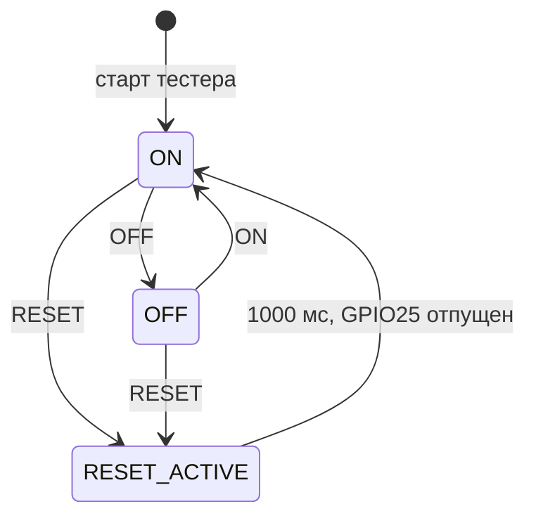
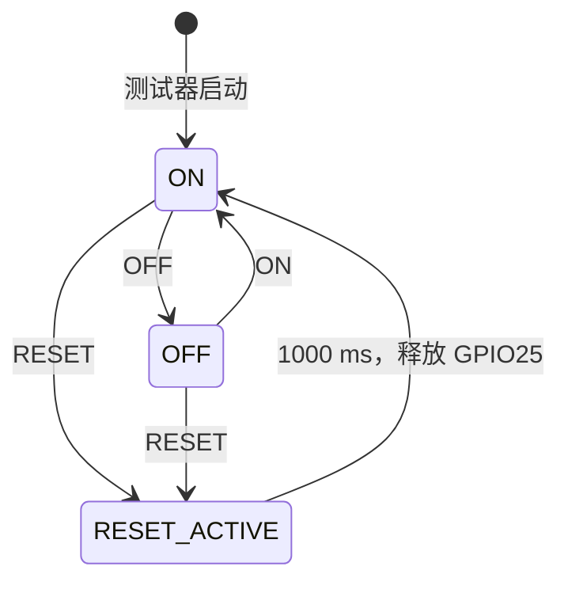
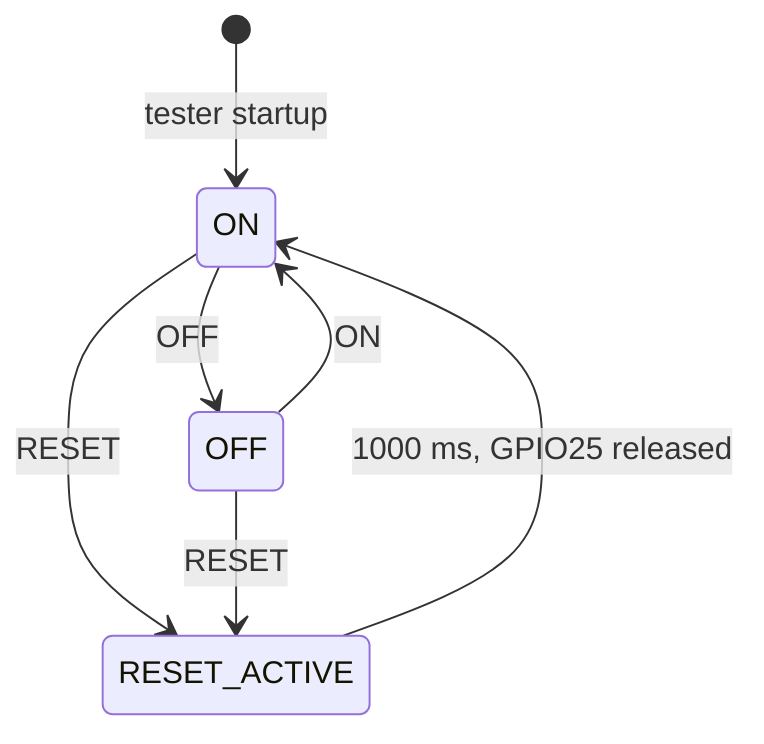

[Русский](#ru) · [中文](#zh) · [English](#en)

## Русский

# Как работает IC WDT Tester

Тестер управляет влиянием внешнего watchdog через реле и наблюдает линию EN.
Он не генерирует WDI проверяемого устройства и не определяет причину сброса по EN.

## Запуск и основной цикл

setup сначала предзагружает HIGH GPIO13, затем включает его выход:
после старта реле ON. GPIO25 освобождён, GPIO33 настроен как INPUT_PULLUP.
Открывается Serial, начинается подключение Wi-Fi.

Каждый проход loop обрабатывает UART, завершение импульса RESET, наблюдение
GPIO33, Wi-Fi, LED и NTP. Пользовательских delay в этом цикле нет; интервалы
отсчитываются по millis. Время выполнения UART и Wi-Fi всё равно влияет
на обслуживание цикла, поэтому длительности импульсов номинальные.

## Реле и внешний сброс

OFF не имеет таймера и не сохраняется в NVS. RESET выключает реле,
прижимает GPIO25 к LOW и планирует включение реле после отпускания.
Если во время RESET поступит OFF, запланированное включение отменяется.

RESET100 даёт диагностический импульс 100 мс и сам не переключает реле.
Повторная reset-команда обновляет начало и длительность импульса; текущая логика
планирования реле сохраняется по [COMMANDS](COMMANDS.md).
RST освобождает GPIO25, отправляет ACK, затем перезапускает тестер; после загрузки ON.

## Наблюдение EN и история

Изменение сырого GPIO33 должно удерживаться 40 мс. Затем фиксируются:
номер, прежний/новый уровень, uptime, Unix-время при наличии NTP, состояние
реле и активность внешнего RESET в момент регистрации.

Хранятся последние 10 переходов; более старые перезаписываются в RAM.
Событие печатается как gpio_change. Автоматическая таблица и HISTORY
повторяют сохранённые записи как gpio_history, replay=true.
Во время активного RESET таблица откладывается до отпускания линии.
После reboot история, номера событий и uptime начинают новый цикл.

## Часы, сеть и LED

До синхронизации unix_time=null, но uptime_ms всегда доступен. NTP настраивается
после подключения Wi-Fi; локальное отображение использует TZ_INFO из main.cpp.
Unix-время — UTC, локальная строка зависит от часового пояса. Время слева в скобках,
добавленное терминалом, относится к приёму строки, а не к самому событию.

| Состояние | GPIO2 |
| --- | --- |
| Нет связи / ожидание следующей попытки | 500 мс свет, 500 мс темно |
| Окно подключения | 125 мс свет, 125 мс темно |
| WL_CONNECTED | Постоянный HIGH, без ожидания NTP |

Окно быстрой индикации — 5 секунд после WiFi.begin; ошибка переводит LED в ожидание.
Попытки повторяются через 10 секунд. После потери связи отсчёт начинается заново.
Без Wi-Fi команды реле/сброса и наблюдение входа продолжают работать.

## Разделение программ

PlatformIO собирает только main.cpp. Сохранённый RelayResetBench — другая реализация:
таймерные leases, ISR-очередь EN и собственный протокол LATCH-02.
Его JSON wdt_pin использует uptime в микросекундах и не имеет NTP-времени.
Нельзя применять tester_control.py к main.cpp: используйте CurrentProtocol
поверх общего Session. Подробнее: [OPERATOR](OPERATOR.md), [TELEMETRY](TELEMETRY.md).

---

## 中文

# IC WDT 测试器如何工作
IC WDT 测试器通过继电器控制外部看门狗的影响，并观察 EN 线。
它不生成被测设备的 WDI 并且不能仅根据 EN 判断复位原因。
## 启动和主循环
setup 首先预加载 GPIO13 为 HIGH，然后启用其输出：
继电器在启动后保持 ON。GPIO25 被释放，GPIO33 设置为 INPUT_PULLUP。
打开串行通信，开始 Wi-Fi 连接。
每次 loop 循环都会处理 UART、RESET 结束脉冲、观察 GPIO33、Wi-Fi、LED 和 NTP。
此循环中没有用户延迟；间隔由 millis 计时。UART 和 Wi-Fi 的执行时间仍然会影响循环的维护，因此脉冲持续时间是名义上的。
## 继电器和外部复位

OFF 没有计时器且不保存到 NVS 中。RESET 关闭继电器，将 GPIO25 保持在 LOW 并计划在释放后重新开启继电器。
如果在 RESET 过程中收到 OFF，则已计划的开启被取消。
RESET100 提供一个诊断脉冲持续 100 毫秒且不切换继电器。重复的 reset 命令更新脉冲开始时间和持续时间；继电器调度逻辑保持不变，详见 [COMMANDS](COMMANDS.md) 中。
RST 释放 GPIO25、发送 ACK，然后重启测试器；启动后继电器为 ON。
## 观察 EN 和历史
GPIO33 原始状态的任何变化应保持 40 毫秒。然后记录：
编号、先前/新的电平、运行时间、如果有 NTP 的 Unix 时间，继电器的状态和外部 RESET 在注册时的活动。

保存最近 10 次变化；更旧的记录在 RAM 中被覆盖。事件输出为 gpio_change。自动表和 HISTORY 将保存的事件重放为 gpio_history，replay=true。RESET 激活期间，表格推迟至线路释放后输出。重启后，历史、事件编号和 uptime 开始新周期。

## 时钟、网络与 LED

同步前 unix_time=null，但 uptime_ms 始终可用。连接 Wi-Fi 后配置 NTP；本地显示使用 main.cpp 的 TZ_INFO。Unix 时间为 UTC，本地时间字符串取决于时区。终端在左侧括号中添加的时间表示收到该行的时间，而不是事件本身的时间。

| 状态 | GPIO2 |
| --- | --- |
| 未连接／等待下次尝试 | 亮 500 ms，灭 500 ms |
| 连接窗口 | 亮 125 ms，灭 125 ms |
| WL_CONNECTED | 持续 HIGH，不等待 NTP |

WiFi.begin 后快速指示窗口持续 5 秒；错误使 LED 返回等待状态。每 10 秒重试；连接丢失后重新计时。没有 Wi-Fi 时，继电器/复位命令和输入监测继续工作。

## 区分不同程序

PlatformIO 仅编译 main.cpp。保留的 RelayResetBench 是另一种实现：定时 lease、EN 的 ISR 队列和独立的 LATCH-02 协议。其 JSON wdt_pin 使用微秒 uptime，没有 NTP 时间。不能将 tester_control.py 用于 main.cpp：应在共用 Session 上使用 CurrentProtocol。详情：[OPERATOR](OPERATOR.md)、[TELEMETRY](TELEMETRY.md)。

---

## English

# How the IC WDT Tester Works
The tester controls the influence of an external watchdog through a relay and observes the EN line.
It does not generate the WDI of the device under test and does not determine the cause of reset by EN.
## Launch and Main Loop
setup first preloads GPIO13 HIGH, then enables its output:
after startup, the relay is ON. GPIO25 is released, GPIO33 is configured as INPUT_PULLUP.
The serial is opened, Wi-Fi connection starts.
Each pass through loop handles UART, RESET pulse end, observes GPIO33, Wi-Fi, LED and NTP.
There are no user delays in this cycle; intervals are counted by millis. The execution time of UART and Wi-Fi still affects the maintenance of the loop, so nominal durations for pulses apply.
## Relay and External Reset

OFF has no timer and is not saved to NVS. RESET turns off the relay, holds GPIO25 LOW and plans re-enabling the relay after release. If OFF is received during a RESET, the planned enabling is canceled.
RESET100 provides a diagnostic pulse of 100 ms duration and does not switch the relay itself. A repeated reset command updates the start time and duration of the pulse; current relay scheduling follows [COMMANDS](COMMANDS.md).
RST releases GPIO25, sends ACK and then restarts the tester; the relay is ON after boot.
## Observing EN and History
Any change in raw GPIO33 should be held for 40 ms. Then recorded are:
number, previous/new level, uptime, Unix time if NTP is present, relay status and external RESET activity at registration.

The last 10 transitions are retained; older entries are overwritten in RAM. An event is printed as gpio_change. The automatic table and HISTORY replay stored entries as gpio_history with replay=true. During active RESET, the table is deferred until the line is released. After reboot, history, event numbers and uptime start a new cycle.

## Clocks, network and LED

Before synchronization unix_time=null, but uptime_ms is always available. NTP is configured after Wi-Fi connects; local display uses TZ_INFO from main.cpp. Unix time is UTC; the local string depends on the time zone. A timestamp added by the terminal in brackets on the left indicates line reception, not the event time.

| State | GPIO2 |
| --- | --- |
| Disconnected / waiting for the next attempt | ON 500 ms, OFF 500 ms |
| Connection window | ON 125 ms, OFF 125 ms |
| WL_CONNECTED | Steady HIGH, without waiting for NTP |

The fast indication window lasts 5 seconds after WiFi.begin; an error returns the LED to waiting. Attempts repeat every 10 seconds; timing restarts after connection loss. Relay/reset commands and input monitoring continue without Wi-Fi.

## Separate programs

PlatformIO builds only main.cpp. The retained RelayResetBench is another implementation with timed leases, an EN ISR queue and its own LATCH-02 protocol. Its wdt_pin JSON uses uptime in microseconds and has no NTP time. Do not use tester_control.py with main.cpp: use CurrentProtocol over the shared Session. Details: [OPERATOR](OPERATOR.md), [TELEMETRY](TELEMETRY.md).
