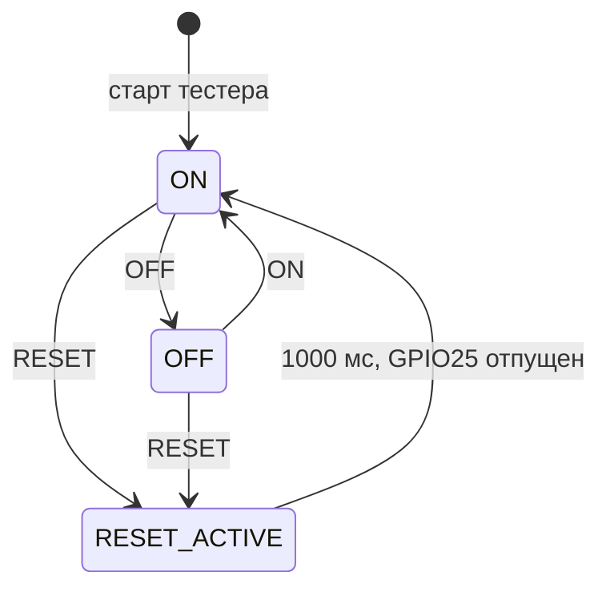

# Как работает IC WDT Tester

Тестер управляет влиянием внешнего watchdog через реле и наблюдает линию EN.
Он не генерирует WDI проверяемого устройства и не определяет причину сброса по EN.

## Запуск и основной цикл

setup сначала предзагружает HIGH GPIO13, затем включает его выход:
после старта реле ON. GPIO25 освобождён, GPIO33 настроен как INPUT_PULLUP.
Открывается Serial, начинается подключение Wi-Fi.

Каждый проход loop обрабатывает UART, завершение импульса RESET, наблюдение
GPIO33, Wi-Fi, LED и NTP. Пользовательских delay в этом цикле нет; интервалы
отсчитываются по millis. Время выполнения UART и Wi-Fi всё равно влияет
на обслуживание цикла, поэтому длительности импульсов номинальные.

## Реле и внешний сброс

OFF не имеет таймера и не сохраняется в NVS. RESET выключает реле,
прижимает GPIO25 к LOW и планирует включение реле после отпускания.
Если во время RESET поступит OFF, запланированное включение отменяется.

RESET100 даёт диагностический импульс 100 мс и сам не переключает реле.
Повторная reset-команда обновляет начало и длительность импульса; текущая логика
планирования реле сохраняется по [COMMANDS](COMMANDS.md).
RST освобождает GPIO25, отправляет ACK, затем перезапускает тестер; после загрузки ON.

## Наблюдение EN и история

Изменение сырого GPIO33 должно удерживаться 40 мс. Затем фиксируются:
номер, прежний/новый уровень, uptime, Unix-время при наличии NTP, состояние
реле и активность внешнего RESET в момент регистрации.

Хранятся последние 10 переходов; более старые перезаписываются в RAM.
Событие печатается как gpio_change. Автоматическая таблица и HISTORY
повторяют сохранённые записи как gpio_history, replay=true.
Во время активного RESET таблица откладывается до отпускания линии.
После reboot история, номера событий и uptime начинают новый цикл.

## Часы, сеть и LED

До синхронизации unix_time=null, но uptime_ms всегда доступен. NTP настраивается
после подключения Wi-Fi; локальное отображение использует TZ_INFO из main.cpp.
Unix-время — UTC, локальная строка зависит от часового пояса. Время слева в скобках,
добавленное терминалом, относится к приёму строки, а не к самому событию.

| Состояние | GPIO2 |
| --- | --- |
| Нет связи / ожидание следующей попытки | 500 мс свет, 500 мс темно |
| Окно подключения | 125 мс свет, 125 мс темно |
| WL_CONNECTED | Постоянный HIGH, без ожидания NTP |

Окно быстрой индикации — 5 секунд после WiFi.begin; ошибка переводит LED в ожидание.
Попытки повторяются через 10 секунд. После потери связи отсчёт начинается заново.
Без Wi-Fi команды реле/сброса и наблюдение входа продолжают работать.

## Разделение программ

PlatformIO собирает только main.cpp. Сохранённый RelayResetBench — другая реализация:
таймерные leases, ISR-очередь EN и собственный протокол LATCH-02.
Его JSON wdt_pin использует uptime в микросекундах и не имеет NTP-времени.
Нельзя применять tester_control.py к main.cpp: используйте CurrentProtocol
поверх общего Session. Подробнее: [OPERATOR](OPERATOR.md), [TELEMETRY](TELEMETRY.md).
