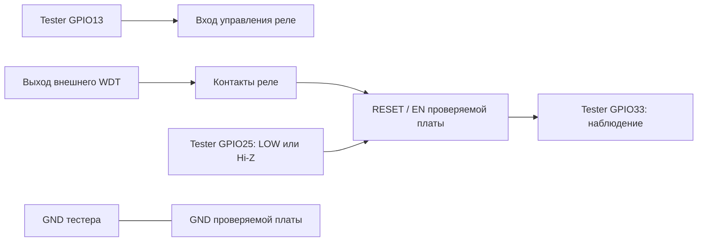
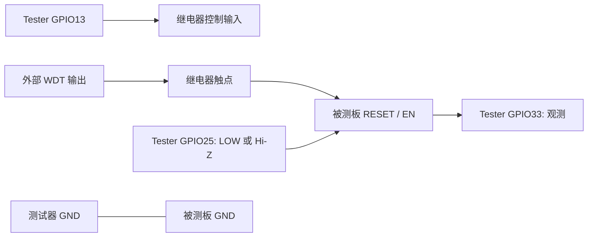

[Русский](#ru) · [中文](#zh) · [English](#en)

## Русский

# Подключение

RU: [Схема IN1232N / DS1232LP и настройка TOL/TD](IC_WDT_HARDWARE.md) — русский, китайский, английский, построчно. Ниже — общие подключения тестера.  
中文：[IN1232N / DS1232LP 电路与 TOL/TD 设置](IC_WDT_HARDWARE.md)按俄语、中文、英语逐行说明。下文为测试器通用接线。  
EN: [IN1232N / DS1232LP circuit and TOL/TD settings](IC_WDT_HARDWARE.md) are provided line by line in Russian, Chinese and English. General tester wiring follows below.

Нужны отдельный тестер на классическом ESP32, проверяемая плата и релейный
модуль с подходящим сигнальным входом. Переставляйте провода при отключённом питании.
Входы ESP32 работают с логикой 3,3 В; не подавайте на них 5 В или напряжение катушки.

Это функциональная схема, не распиновка NO/NC/COM конкретного реле.

| Сигнал тестера | Куда подключать | Проверить до работы |
| --- | --- | --- |
| GPIO13 | Логический вход управления реле | HIGH должен включать требуемый путь WDT; инверсный модуль требует согласования схемы |
| GPIO25 | Внешний RESET/EN | Сброс активен LOW, у целевой платы есть штатная подтяжка |
| GPIO33 | Наблюдаемая точка EN/RESET | Это измерение уровня, не питание и не выход |
| GPIO2 | LED с ограничением тока либо совместимый встроенный LED | Код считает HIGH включением; полярность зависит от платы |
| GND | GND целевой платы и управляющей части реле | Общая опорная земля |

GPIO25 в покое — INPUT без внутренней подтяжки. Перед импульсом в выходной
регистр записывается LOW, затем включается OUTPUT. После импульса вывод становится
входом; высокий уровень создаёт внешняя подтяжка, а не тестер.

GPIO33 имеет INPUT_PULLUP. Поэтому HIGH сам по себе не доказывает, что провод
подключён. Короткие импульсы менее 40 мс могут не попасть в журнал.
Переходы GPIO33 не являются автоматическим счётчиком срабатываний WDT.

GPIO12 прежней схемы освобождён: на классическом ESP32 его HIGH при старте может
выбрать питание flash 1,8 В. Не переносите эту распиновку автоматически на ESP32-S3,
C3 и другие семейства. [Документация Espressif по strapping-пинам](https://docs.espressif.com/projects/esptool/en/latest/esp32/advanced-topics/boot-mode-selection.html).

Сначала проверьте HELP/STS и физическое соответствие GPIO. Фактические контакты
реле, прохождение импульса до EN и форму сигнала проверяют отдельно измерением.
RESETDIAG показывает регистры/уровни ESP32, но не заменяет проверку проводки.

---

## 中文

# 接线

RU: [Схема IN1232N / DS1232LP и настройка TOL/TD](IC_WDT_HARDWARE.md) — русский, китайский, английский, построчно. Ниже — общие подключения тестера.
中文：[IN1232N / DS1232LP 电路与 TOL/TD 设置](IC_WDT_HARDWARE.md)按俄语、中文、英语逐行说明。下文为测试器通用接线。
EN: [IN1232N / DS1232LP circuit and TOL/TD settings](IC_WDT_HARDWARE.md) are provided line by line in Russian, Chinese and English. General tester wiring follows below.

需要一个经典的ESP32测试器、被测板和带合适信号输入的继电器模块。在断电状态下更换导线。
ESP32的输入工作电压为3.3V；不要提供5V或线圈电压。

这是功能图，不是NO/NC/COM具体继电器的引脚分配。
| 测试器信号 | 连接到哪里 | 工作前检查 |
| --- | --- | --- |
| GPIO13 | 继电器逻辑控制输入 | HIGH应激活所需的WDT路径；反相模块需要与电路匹配 |
| GPIO25 | 外部RESET/EN | 低电平有效，目标板具备自身的正常上拉电路 |
| GPIO33 | 观察到的EN/RESET点 | 这是测量电压水平，不是供电或输出 |
| GPIO2 | 带限流器的LED或兼容内置LED | 程序认为HIGH为开启；极性取决于板子 |
| GND | 目标板和继电器控制部分的GND | 公共参考地 |

GPIO25在静止状态下是INPUT，不启用内部上拉。在脉冲前向输出寄存器写入LOW，然后切换为OUTPUT。
脉冲后该引脚恢复为输入；高电平由外部上拉产生，而不是测试器。

GPIO33 具有 INPUT_PULLUP。因此，单独的 HIGH 并不能证明导线已连接。小于 40 毫秒的短脉冲可能不会被记录在日志中。GPIO33 的转换不是 WDT 触发自动计数器。

旧方案中的 GPIO12 已释放：在经典的 ESP32 上，它在启动时为 HIGH 可能会选择 1.8V 的 flash 电源。不要将此引脚分配自动转移到 ESP32-S3、C3 和其他系列上。[Espressif 文档关于 strapping-引脚](https://docs.espressif.com/projects/esptool/en/latest/esp32/advanced-topics/boot-mode-selection.html)。

首先检查 HELP/STS 和 GPIO 的物理连接情况。实际的继电器触点、脉冲到达 EN 之前的路径和信号波形需要单独测量。RESETDIAG 显示 ESP32 的寄存器/电平，但不能替代布线检查。

---

## English

# Wiring

RU: [Схема IN1232N / DS1232LP и настройка TOL/TD](IC_WDT_HARDWARE.md) — русский, китайский, английский, построчно. Ниже — общие подключения тестера.
中文：[IN1232N / DS1232LP 电路与 TOL/TD 设置](IC_WDT_HARDWARE.md)按俄语、中文、英语逐行说明。下文为测试器通用接线。
EN: [IN1232N / DS1232LP circuit and TOL/TD settings](IC_WDT_HARDWARE.md) are provided line by line in Russian, Chinese and English. General tester wiring follows below.

A classic ESP32 tester, a board under test, and a relay module with an appropriate signal input are required. Change wires while powered off.
The ESP32 inputs operate at 3.3V logic; do not provide 5V or coil voltage.

This is a functional diagram, not the pinout of NO/NC/COM on a specific relay.
| Tester Signal | Connect to | Check before operation |
| --- | --- | --- |
| GPIO13 | Relay logic control input | HIGH should activate the required WDT path; an inverting module requires matching with the circuit |
| GPIO25 | External RESET/EN | Active LOW, the target board has its normal pull-up circuit |
| GPIO33 | Observed EN/RESET point | This is a voltage level measurement, not power or output |
| GPIO2 | LED with current limiter or compatible built-in LED | The code considers HIGH as on; polarity depends on the board |
| GND | Target board and relay control section's GND | Common reference ground |

GPIO25 is INPUT without internal pull-up when idle. Before a pulse, LOW is written to the output register, then it switches to OUTPUT.
After the pulse, the pin becomes an input again; HIGH level is created by external pull-up, not by the tester.

GPIO33 has INPUT_PULLUP. Therefore, HIGH alone does not prove that the wire is connected. Short pulses less than 40 ms may not be recorded in the log. Transitions of GPIO33 are not an automatic counter for WDT triggers.

GPIO12 from the old scheme is released: on a classic ESP32, it being HIGH at startup might select 1.8V flash power. Do not automatically transfer this pinout to ESP32-S3, C3 and other families. [Espressif documentation about strapping-pins](https://docs.espressif.com/projects/esptool/en/latest/esp32/advanced-topics/boot-mode-selection.html).

First check HELP/STS and the physical connection of GPIO. Actual relay contacts, path of pulse before EN and signal waveform need separate measurement. RESETDIAG shows ESP32 registers/levels but does not replace wiring checks.
