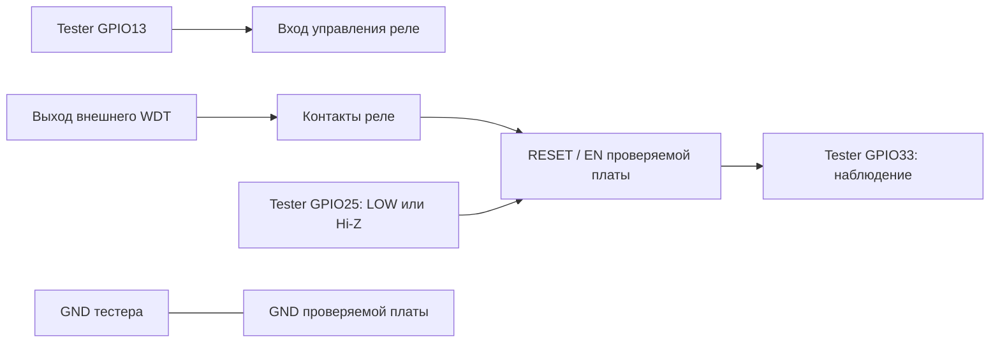

# Подключение

RU: [Схема IN1232N / DS1232LP и настройка TOL/TD](IC_WDT_HARDWARE.md) — русский, китайский, английский, построчно. Ниже — общие подключения тестера.  
中文：[IN1232N / DS1232LP 电路与 TOL/TD 设置](IC_WDT_HARDWARE.md)按俄语、中文、英语逐行说明。下文为测试器通用接线。  
EN: [IN1232N / DS1232LP circuit and TOL/TD settings](IC_WDT_HARDWARE.md) are provided line by line in Russian, Chinese and English. General tester wiring follows below.

Нужны отдельный тестер на классическом ESP32, проверяемая плата и релейный
модуль с подходящим сигнальным входом. Переставляйте провода при отключённом питании.
Входы ESP32 работают с логикой 3,3 В; не подавайте на них 5 В или напряжение катушки.

Это функциональная схема, не распиновка NO/NC/COM конкретного реле.

| Сигнал тестера | Куда подключать | Проверить до работы |
| --- | --- | --- |
| GPIO13 | Логический вход управления реле | HIGH должен включать требуемый путь WDT; инверсный модуль требует согласования схемы |
| GPIO25 | Внешний RESET/EN | Сброс активен LOW, у целевой платы есть штатная подтяжка |
| GPIO33 | Наблюдаемая точка EN/RESET | Это измерение уровня, не питание и не выход |
| GPIO2 | LED с ограничением тока либо совместимый встроенный LED | Код считает HIGH включением; полярность зависит от платы |
| GND | GND целевой платы и управляющей части реле | Общая опорная земля |

GPIO25 в покое — INPUT без внутренней подтяжки. Перед импульсом в выходной
регистр записывается LOW, затем включается OUTPUT. После импульса вывод становится
входом; высокий уровень создаёт внешняя подтяжка, а не тестер.

GPIO33 имеет INPUT_PULLUP. Поэтому HIGH сам по себе не доказывает, что провод
подключён. Короткие импульсы менее 40 мс могут не попасть в журнал.
Переходы GPIO33 не являются автоматическим счётчиком срабатываний WDT.

GPIO12 прежней схемы освобождён: на классическом ESP32 его HIGH при старте может
выбрать питание flash 1,8 В. Не переносите эту распиновку автоматически на ESP32-S3,
C3 и другие семейства. [Документация Espressif по strapping-пинам](https://docs.espressif.com/projects/esptool/en/latest/esp32/advanced-topics/boot-mode-selection.html).

Сначала проверьте HELP/STS и физическое соответствие GPIO. Фактические контакты
реле, прохождение импульса до EN и форму сигнала проверяют отдельно измерением.
RESETDIAG показывает регистры/уровни ESP32, но не заменяет проверку проводки.
